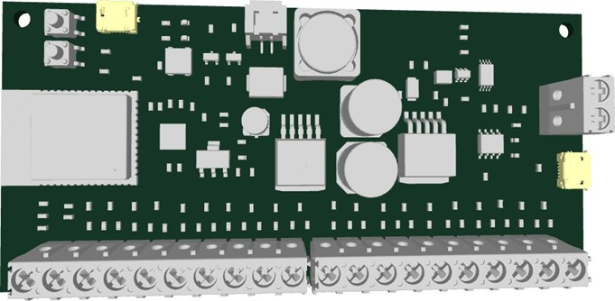
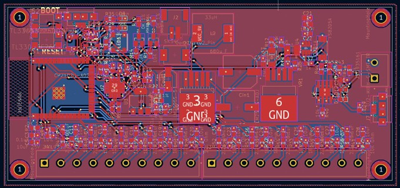
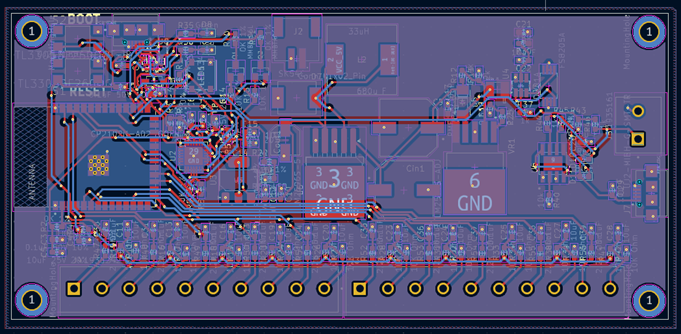
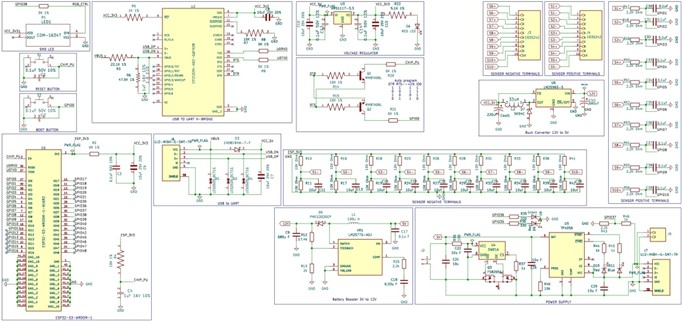

# Energy Monitoring System PCB

**Author:** Sree Harsha Kuragayala  
**Role:** Graduate Apprentice  
**Organization:** Central Manufacturing Technology Institute (CMTI), Bangalore  

---

## Portfolio Notice

This repository is created for **recruiter viewing and portfolio demonstration only**.  
It showcases the design and development of an Industrial Energy Monitoring System PCB.

Full industrial design files, firmware, and proprietary implementation are not publicly shared.

---

## Project Overview

The Energy Monitoring System PCB is an industrial-grade hardware solution designed to monitor electrical energy consumption in real time across multiple channels. The system supports IoT-based remote monitoring, enabling efficient power tracking, analysis, and optimization.

---

## Hardware Preview

### 3D PCB View

### PCB Top Layer

### PCB Bottom Layer

### Schematic Overview

---

## Key Features

- ESP32-S3 based high-performance microcontroller  
- Supports up to **10 CT Sensors** for multi-channel monitoring  
- Real-time RMS, Power & Power Factor calculation  
- Wi-Fi & Bluetooth connectivity  
- MQTT-based IoT communication  
- Buck converter based stable power architecture  
- Battery charging & backup support  
- Compact 2-layer PCB for industrial integration  

---

## My Contribution

- Complete PCB Design using **KiCad**
- Schematic design and component selection  
- Analog signal conditioning for CT sensors  
- Power supply and buck converter design  
- PCB layout, routing, and DRC verification  
- Fabrication-ready design generation  

---

## System Capabilities

- Real-time Energy Monitoring  
- Multi-channel Current Measurement  
- Power Factor & Phase Angle Monitoring  
- Industrial Energy Optimization  
- IoT Remote Monitoring  

---

## Tools & Technologies

- KiCad (PCB Design)  
- Embedded Hardware Design  
- ESP32 Platform  
- IoT Communication (MQTT)  
- Power Electronics  

---

## Repository Contents

This repository contains only **non-confidential portfolio materials**:

- Project overview
- Hardware description
- Demonstration content

Full schematics, firmware, and proprietary files are intentionally not included.

---

## Contact

**Sree Harsha Kuragayala**  
Embedded Hardware | IoT 
Email: sreeharsha.k83@gmail.com  

---

## License

This project is protected under a **Proprietary Portfolio License**.  
Unauthorized use, copying, modification, or distribution is not permitted.

See `LICENSE` file for details.
